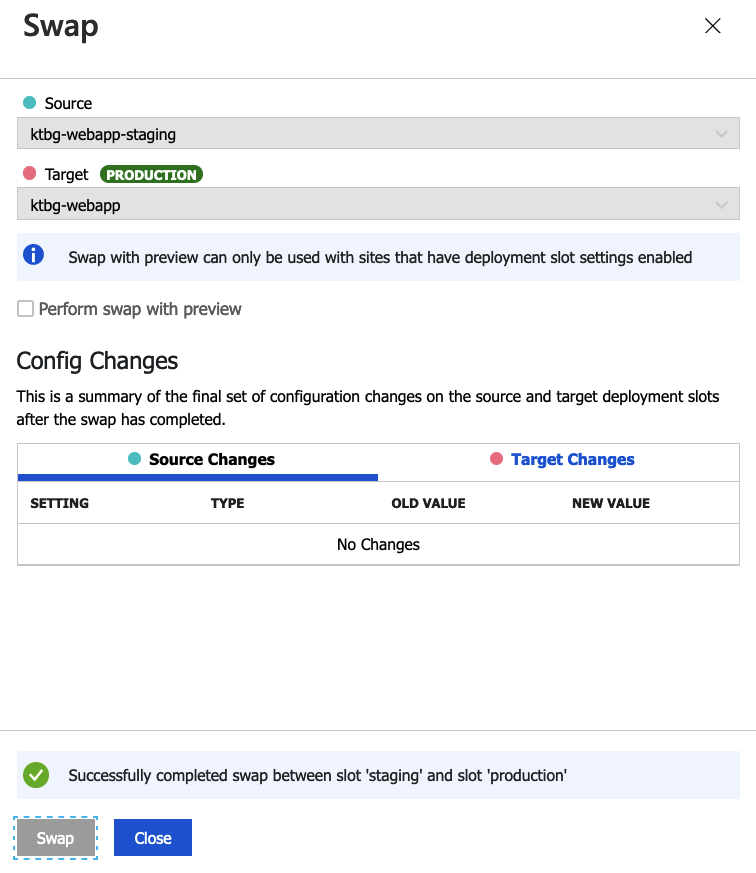

### Project Description

KeepTheBoxGreen project introduces the implementation of the Arduino device, which collects data from various sensors such as ultrasonic sensor, humidity/temperature sensor, and dust sensor.

It has simple logic behind which helps to indicate if any working conditions are violated by changing the colour of a box #keepTheBoxGreen. For example, when a person is sitting in front of the laptop for more than 1 hour or air quality drops, the box's light changes its colour to red, and the LCD prints a piece of appropriate advice.

Current repository contains the code for the frontend for KeepTheBoxGreen project.

- [Link](https://github.com/some-otter-thing/keepTheBoxGreen-arduino) for Arduino repository
- [Link](https://github.com/some-otter-thing/keepTheBoxGreen-api) for API repository

### Installation

Prerequisites: Node v14 and Docker

To install this project and run it locally, please follow the following steps:

1. Clone repo and install dependencies

```

yarn install

```

2. Run the project in dev mode: you need to have your docker application running

```

yarn dev

```

3. Run the project in production mode:

```

yarn build

```

```

yarn start

```

4. Visit http://localhost:3000

### Continuous Integration and Continuous Deployment

#### Tools of CI/CD:

We went with Github Actions for setting up the automated workflow. Since we use Azure App Service for deployment, we've also looked into Azure's own CI/CD tool, Azure DevOps. Both of the services are excellent tools to automatically build, test, publish and deploy software updates. The main reasons we chose Github Action over Azure DevOps were that we already use Github for our source control hence more familiar, and the possibility to open source.

#### Diagram of CI/CD Pipeline:


CI:

- Build(install dependencies, lint, unit testing)
- Sonar Cloud Analysis (Scan security vulnerabilities, code smell)

CD:

- Docker(Build Image, tag image and push to azure container registry)
- Deploy to staging environment
- Deploy to production environment (manual)

#### Blue-Green Deployment

For continuous deployment, we take the blue-green deployment approach. In staging environment(blue) when we finish QA testing and once the software is good to go, we can switch the router so all incoming requests go to the blue environment from green environment(production). This way we can minimize the downtime during deployment. On Azure app service, you can easily add deployment slots. Through this service we cloned the existing application and assigned it to staging slot.


Azure app service enables swap operation of two environments easily.



#### Workflow on Pull Request


When pull request happens, only CI process runs (build, lint, testing, sonarcloud scan) and skips the CD steps on the pipeline. We decided not to deploy pull requests since it might get expensive when there are many pull requests at the same time.

#### Workflow on Push to Main Branch


When commits are pushed to the main branch the entire CI/CD process runs. CD process only runs on the main branch. Docker build is processed only when unit testing and sonarcloud scan has been approved.

Deployment to production is protected, and has to be manually triggered. The workflow automatically requests review to the assigned member once the deployment on staging environment has been completed.

#### Slack Notification on Deployment to Production


