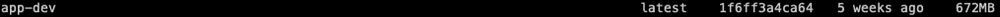
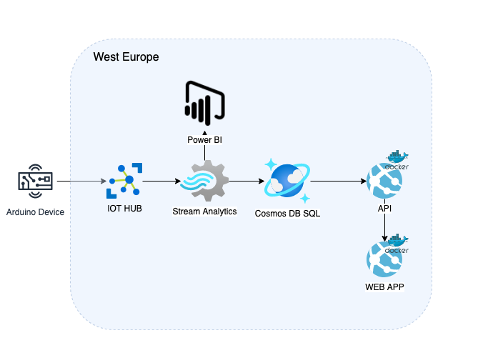
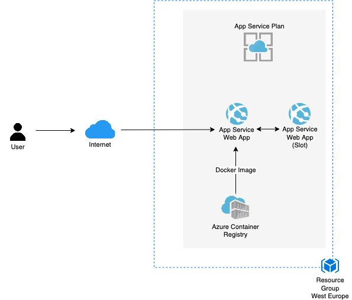
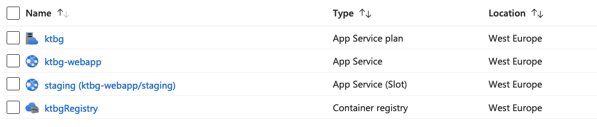
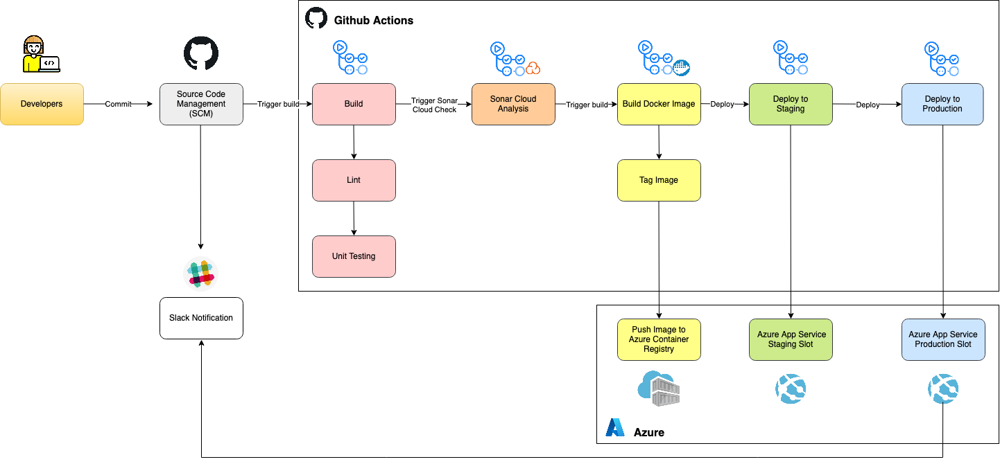
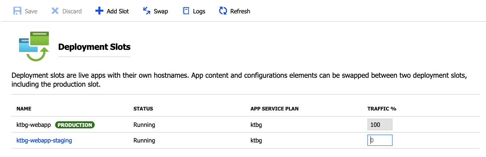
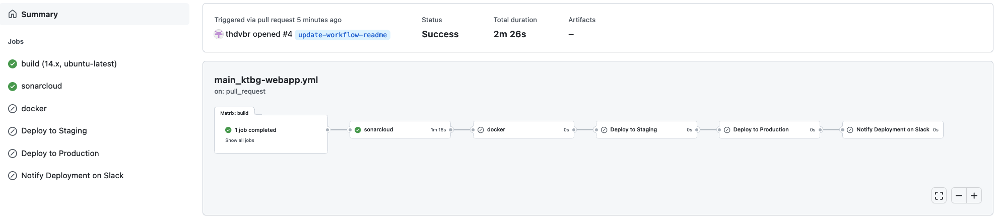
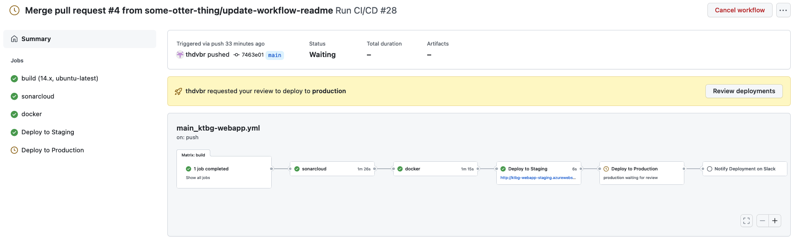
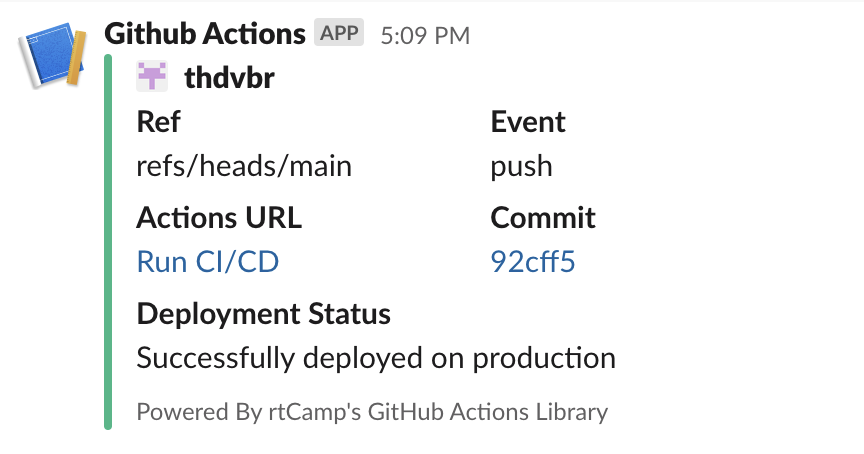

### Table of Contents

- [Project Description](#project-description)
- [Project Status and Upcoming Features](#project-status-and-upcoming-features)
- [Deployment](#deployment)
- [Installation](#installation)
- [Docker](#docker)
- [Cloud Infrastructure](#cloud-infrastructure)
- [Continuous Integration and Continuous Deployment](#continuous-integration-and-continuous-deployment)

### Project Description

KeepTheBoxGreen project introduces the implementation of the Arduino device, which collects data from various sensors such as ultrasonic sensor, humidity/temperature sensor, and dust sensor.

It has simple logic behind which helps to indicate if any working conditions are violated by changing the colour of a box #keepTheBoxGreen. For example, when a person is sitting in front of the laptop for more than 1 hour or air quality drops, the box's light changes its colour to red, and the LCD prints a piece of appropriate advice.

Current repository contains the code for the frontend for KeepTheBoxGreen project.

- [Link](https://github.com/some-otter-thing/keepTheBoxGreen-arduino) for Arduino repository
- [Link](https://github.com/some-otter-thing/keepTheBoxGreen-api) for API repository

### Project Status and Upcoming Features

Currently the web app only serves the current device data from our api.
The features that will be implemented soon in the future include:

- Authentication
- Device Configuration Interface for users
- Display device data with various filters
- Generative art with the device data

### Deployment

The web app is containerized and running on Azure App Services.

- [Production environment](https://ktbg-webapp.azurewebsites.net/) of #keepTheBoxGreen web app
- [Staging environment](https://ktbg-webapp-staging.azurewebsites.net/) of #keepTheBoxGreen web app

### Installation

Prerequisites: Node v14 and Docker

To install this project and run it locally, please follow the following steps:

1. Clone repo and install dependencies

```

yarn install

```

2. Run the project in dev mode: you need to have your docker application running. This spins up a docker container with development image.

```

yarn dev

```

3. Run the project in production mode:

```

yarn build
yarn start

```

4. Visit http://localhost:3000

### Docker

#### Builder Pattern with Multistage Builds

To optimize the image build process we implemented builder pattern and split the build process into multiple stages. We used multistage builds in a single Dockerfile to define different stages of build. In the build stage, we copy the source code, install dependencies and create build artifacts upon all the necessary build utilities available. In the run stage, we copy the built binaries in another smaller image and deploy it which results in the size reduction. This process reduces any unnecessary assets getting shipped to production and also affects the deployment hugely. Smaller docker containers can push and pull faster from the container registry, which means higher deployment speed - better performance. They are also cost effective and secure, since they have less attack surface for vulnerabilities.

You can see that the image size has reduced from 672mb to 22mb through optimization of build process.



#### To Run Production Docker Container

```
docker-compose -f docker-compose.prod.yml build
docker run -p 80:80 --name <name> app-prod
```

### Cloud Infrastructure

We chose Microsoft Azure as our cloud service provider for this project.

#### Diagram for #keepTheBoxGreen:



For the deployment of the web app we used Azure App Services, which is the most popular and widely used fully managed Platform as a Service(PaaS). Azure App Services has high scalability, security, and covers all the compliance requirements along with supporting high performance by auto scaling of services. We chose App Services over hosting via virtual machines since we don't need full control and wanted to take advantage on easy deployment and built-in security of PaaS.

#### Detailed Architecture Diagram for the #keepTheBoxGreen Web App:



#### Used Cloud Services



The site is hosted in App Services and it is running under an App Service Plan. Docker image of the web app has been uploaded to Azure Container Registry. App Service retrieves the image from the registry and is configured for continuous deployment with github actions workflow. We used two deployment slots on App Service, one for staging environment and one for production. These assets are called resources and they are stored in the resource group thats located in west europe.

### Continuous Integration and Continuous Deployment

#### CI/CD Tool:

Continuous integration and deployment in this project are done by Github Actions. Since we use Azure App Service for deployment, we've also looked into Azure's own CI/CD tool, Azure DevOps. Both of the services are excellent tools to automatically build, test, publish and deploy software updates. The main reasons we chose Github Action over Azure DevOps were that we already use Github for our source control hence more familiar, and the possibility to open source.

#### Diagram of CI/CD Pipeline:



CI:

- Build(install dependencies, lint, unit testing)
- Sonar Cloud Analysis (Scan security vulnerabilities, code smell)

CD:

- Docker(Build Image, tag image and push to azure container registry)
- Deploy to staging environment
- Deploy to production environment (manual trigger)

#### Blue-Green Deployment

For continuous deployment, we take the blue-green deployment approach. In staging environment(blue) when we finish QA testing and once the software is good to go, we can switch the router so all incoming requests go to the blue environment from green environment(production). This way we can minimize the downtime during deployment. Azure App Services provides way to add deployment slots for adding staging environment. Through this service we cloned the existing application and assigned it to staging slot. Swap operation of two environments on Azure is straight forward.



#### Workflow on Pull Request



When pull request happens, only CI process runs (build, lint, testing, sonarcloud scan) and skips the CD steps on the pipeline. We decided not to deploy pull requests since it might get expensive when there are many pull requests at the same time.

#### Workflow on Push to Main Branch



When commits are pushed to the main branch the entire CI/CD process runs. CD process only runs on the main branch. Docker build is processed only when unit testing and sonarcloud scan has been approved.

Deployment to production is protected, and has to be manually triggered. The workflow automatically requests review to the assigned member once the deployment on staging environment has been completed.

#### Slack Notification on Deployment to Production


